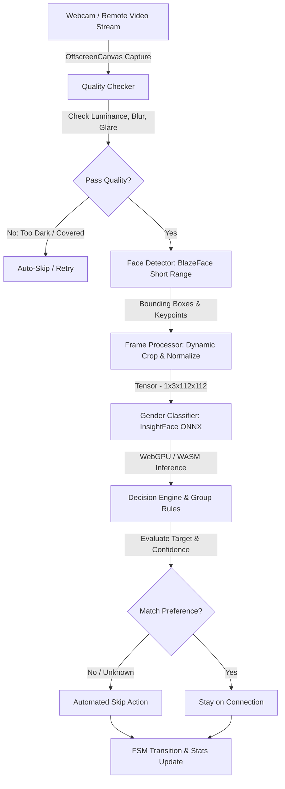

# SkipSense ⚡

<div align="center">

**Fully Local, 100% Offline AI-Powered Chrome Extension for Intelligent Video Chat Filtering**

[](https://www.typescriptlang.org/)
[](https://reactjs.org/)
[](https://developer.chrome.com/docs/extensions/mv3/intro/)
[](https://onnxruntime.ai/)
[](https://developers.google.com/mediapipe)
[](https://tailwindcss.com/)
[](LICENSE)

</div>

---

## 📖 Overview

**SkipSense** is an open-source, privacy-first Chrome Extension (Manifest V3) designed for automated video chat interaction on platforms such as OmeTV. It uses on-device computer vision models running directly inside the browser using **WebGPU / WebAssembly (WASM)** and **Web Workers** to analyze incoming video streams and automatically skip connections based on user-defined presentation preferences.

**Zero cloud servers. Zero telemetry. Zero video frames or personal data ever leave your machine.**

---

## ⚠️ Current Status & Detection Limitations

> [!IMPORTANT]
> **Beta Optimization Notice**: SkipSense uses ultra-lightweight, on-device neural networks designed to run at near-instant speeds (20–60ms) directly in your browser. While it performs reliably in standard webcam conditions, it is **currently not 100% optimized** for all real-world edge cases:
>
> - **🌙 Low-Light & Dark Environments**: In poorly lit rooms, pitch-black settings, or extreme backlighting, camera sensor noise increases and facial contrast drops significantly. If the luminance is too low ($< 38/255$), the built-in quality checker flags the frame as `TOO_DARK` and will trigger an automatic skip or retry rather than making an inaccurate guess.
> - **👥 Group Settings & Multi-Person Frames**: Although SkipSense incorporates multi-face bounding box detection, complex crowd scenes, overlapping faces, side-profile angles, heavy occlusions (hands/masks/hats), or people far in the background can result in missed detections or ambiguous classifications.
> - **💨 Fast Motion & Extreme Blur**: Sudden camera shaking or quick stranger transitions can cause motion blur. Using the configurable **Detection Delay** setting (e.g., 500–1000ms) helps give the camera feed time to stabilize before running inference.
>
> We are actively working on multi-frame temporal voting, adaptive exposure compensation, and refined group clustering algorithms in upcoming releases!

---

## ✨ Key Features

- 🔒 **100% Local & Privacy-Preserving**
  - All AI inference executes client-side via **ONNX Runtime Web** and **MediaPipe Tasks Vision**.
  - No external API requests, no cloud servers, and no analytics or telemetry tracking.
- ⚡ **High-Performance Architecture (No UI Lag)**
  - Computation is isolated inside dedicated **Web Workers** and **OffscreenCanvas** pipelines, ensuring the browser UI and video streams remain 60fps smooth without stutters.
  - Supports hardware-accelerated **WebGPU** with automatic fallback to **WASM SIMD**.
- 🎯 **Customizable Presentation & Confidence Filtering**
  - Filter by target presentation: `MALE`, `FEMALE`, or `ANY`.
  - Configurable confidence threshold (60% to 99%) with customizable fallback behavior (`SKIP`, `RETRY`, `WAIT`).
- 👥 **Group Logic & Multi-Person Spatial Grouping**
  - Scans full frames for multiple individuals. If filtering for a target and any individual of the opposite presentation is present in the group, the decision engine immediately triggers an auto-skip.
- 🔍 **Real-Time Frame Quality & Anti-Trolling Filter**
  - Automatically assesses average luminance, overexposure/glare, and contrast standard deviation to filter out dark rooms, covered cameras, and blank screens.
- 🔄 **Resilient Finite State Machine (FSM)**
  - Managed state flow (`Idle` ➔ `WaitingForConnection` ➔ `CapturingFrame` ➔ `RunningInference` ➔ `MakingDecision` ➔ `Skipping`) with automated retry loops and DOM MutationObservers resilient against site layout shifts.
- 📊 **Live Stats & Modern React Popup**
  - Real-time dashboard showing total connections, skip counts, acceptance rate, average confidence, and inference latency in a clean dark/light UI.

---

## 🏗️ System Architecture



### Module Structure

```
skipsense/
├── public/
│   ├── assets/               # Icons and UI images
│   └── models/               # BlazeFace TFLite, InsightFace ONNX & WASM binaries
├── scripts/
│   └── setup-models.mjs      # Model downloader & SHA256 checksum validator
├── src/
│   ├── ai/                   # AI inference pipeline
│   │   ├── FaceDetector.ts      # MediaPipe BlazeFace wrapper
│   │   ├── FrameProcessor.ts    # Bounding box crop, scaling & tensor normalization
│   │   ├── GenderClassifier.ts  # ONNX Runtime Web session & metadata extraction
│   │   ├── InferencePipeline.ts # Orchestrator for detection + classification
│   │   ├── ModelManager.ts      # Checksum verification & model asset loader
│   │   └── QualityChecker.ts    # Luminance, contrast & obstruction diagnostics
│   ├── background/           # Manifest V3 service worker & lifecycle manager
│   ├── components/           # Reusable UI widgets & stat cards
│   ├── content/              # Content scripts injected into target sites
│   ├── core/                 # Decoupled state machine, event bus & decision logic
│   │   ├── DecisionEngine.ts    # Rule evaluation (target, confidence, groups)
│   │   ├── MessageBus.ts        # Strongly-typed Chrome runtime messaging
│   │   └── StateMachine.ts      # Finite State Machine (FSM)
│   ├── offscreen/            # Offscreen document for Web Worker AI execution
│   ├── options/              # React options dashboard
│   ├── popup/                # Extension popup UI
│   ├── sites/                # Modular Site Adapter interface & OmeTV adapter
│   ├── storage/              # Typed Chrome storage syncing & defaults
│   ├── types/                # Global TypeScript definitions & interfaces
│   └── worker/               # Web Worker handling tensor math off-main-thread
├── manifest.json             # Chrome Manifest V3 configuration
├── package.json
└── vite.config.ts            # Vite + CRXJS build configuration
```

---

## 🧠 The Open-Source AI Stack

SkipSense uses verified, lightweight open-source models:

| Model Component | Model File | Source / Architecture | License |
| :--- | :--- | :--- | :--- |
| **Face Detector** | `blaze_face_short_range.tflite` | [MediaPipe BlazeFace Short Range](https://developers.google.com/mediapipe/solutions/vision/face_detector) | Apache 2.0 |
| **Presentation Classifier** | `genderage.onnx` | [InsightFace Antelopev2](https://github.com/deepinsight/insightface) (`112x112` RGB input) | MIT |
| **Inference Runtime** | ONNX Runtime Web + WASM | [Microsoft ONNX Runtime](https://github.com/microsoft/onnxruntime) (WebGPU / WASM SIMD) | MIT |

### Checksum Verification

All models are validated via **SHA256 checksums** during setup and load:
- `blaze_face_short_range.tflite`: `b4578f35940bf5a1a655214a1cce5cab13eba73c1297cd78e1a04c2380b0152f`
- `genderage.onnx`: `4fde69b1c810857b88c64a335084f1c3fe8f01246c9a191b48c7bb756d6652fb`

---

## 🚀 Getting Started

### Prerequisites

- **Node.js** `>= 18.0.0`
- **npm** `>= 9.0.0`
- A modern Chromium browser (Google Chrome, Brave, Microsoft Edge, Opera, etc.)

### Installation & Build

1. **Clone the repository**:
   ```bash
   git clone https://github.com/Pranav00076/skipsense.git
   cd skipsense
   ```

2. **Install dependencies**:
   ```bash
   npm install
   ```
   *(This automatically executes `scripts/setup-models.mjs` to download the AI models and verify their SHA256 hashes).*

3. **Build the extension**:
   ```bash
   npm run build
   ```
   The compiled extension will be output to the `dist/` directory.

### Loading into Chrome

1. Open your browser and navigate to `chrome://extensions/`.
2. Toggle **Developer mode** in the top right corner.
3. Click **Load unpacked** in the top left.
4. Select the `dist/` folder from the `skipsense` project root.
5. The **SkipSense** icon will appear in your Chrome toolbar! ⚡

---

## ⚙️ Configuration & Options

Click the SkipSense toolbar icon or open the full Options page to customize your preferences:

| Setting | Default | Description |
| :--- | :--- | :--- |
| **Extension Enabled** | `true` | Master toggle to enable or pause automated skipping. |
| **Target Presentation** | `FEMALE` | Target to match (`FEMALE`, `MALE`, `ANY`). |
| **Confidence Threshold** | `0.75` | Minimum required confidence score ($0.60$ to $0.99$) before accepting a match. |
| **Detection Delay** | `500ms` | Time to wait after a new connection is established before capturing a frame (lets video adjust). |
| **Max Retries** | `3` | Number of frame re-evaluations attempted on low confidence before executing fallback. |
| **Unknown / Ambiguous Action** | `SKIP` | Action to take when confidence is below threshold after retries (`SKIP`, `RETRY`, `WAIT`). |
| **Preferred Backend** | `WASM` | Inference compute backend (`WEBGPU` for maximum speed or `WASM` for compatibility). |
| **Debug Mode** | `false` | Enables detailed console diagnostic logs in DevTools. |

---

## 🛠️ Development & Testing

```bash
# Start Vite development server with Hot Module Reloading
npm run dev

# Run Vitest test suites
npm test

# Run ESLint validation
npm run lint

# Format code with Prettier
npm run format
```

### Adding New Site Adapters

SkipSense uses a modular adapter pattern. To support another video chat platform:
1. Create a new adapter in `src/sites/` implementing the `SiteAdapter` interface:
   ```typescript
   export interface SiteAdapter {
     readonly siteName: string;
     isTargetSite(): boolean;
     getRemoteVideoElement(): HTMLVideoElement | null;
     skip(): Promise<boolean>;
     waitForNextConnection(): Promise<void>;
     cleanup(): void;
   }
   ```
2. Register your adapter in `src/sites/index.ts` and add matching URLs to `manifest.json`.

---

## 🛡️ Privacy, Security & Responsible Use

- **Client-Side Guarantee**: SkipSense runs entirely within your browser sandbox. No video, images, biometrics, or personal identifiers are collected, stored, or sent to any server.
- **Educational & Research Purpose**: This extension is built as a technical demonstration of modern on-device WebGPU/WASM computer vision and Chrome Manifest V3 architecture.
- **Platform Terms**: Please respect the terms of service of any platform you interact with.

---

## 📄 License

Distributed under the **MIT License**. See `LICENSE` for more information.

---

<div align="center">
Made with ❤️ by <a href="https://github.com/Pranav00076">Pranav</a>
</div>
